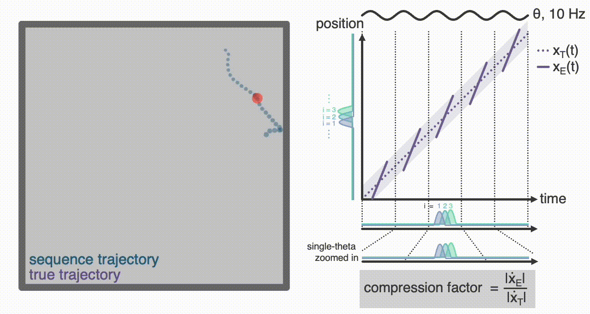

---

##### Download

+ [Paper](eligibilitytheta.pdf)
+ [OpenReview](https://openreview.net/forum?id=vd16AYbem3Z)
+ [Code and data](https://github.com/TomGeorge1234/ThetaSequencesAreEligibilityTraces)

---

##### Abstract

Credit assignment problems, for example policy evaluation in RL, often require bootstrapping prediction errors through preceding states or maintaining temporally extended memory traces; solutions which are unfavourable or implausible for biological networks of neurons. We propose theta sequences -- chains of neural activity during theta oscillations in the hippocampus, thought to represent rapid playthroughs of awake behviour -- as a solution. By analysing and simulating a model for theta sequences we show they compress behaviour such that existing but short Ο(10) ms neuronal memory traces are effectively extended allowing for bootstrap-free credit assignment without long memory traces, equivalent to the use of eligibility traces in TD(λ).

---




---

##### Citation

George, Tom M. "Theta sequences as eligibility traces: A biological solution to credit assignment." ICLR Tiny Papers workshop (2023).

```BibTeX
@misc{
george2023theta,
title={Theta sequences as eligibility traces: A biological solution to credit assignment},
author={Tom George},
year={2023},
journal={ICLR Tiny Papers workshop},
url={https://openreview.net/forum?id=vd16AYbem3Z}
}
```
