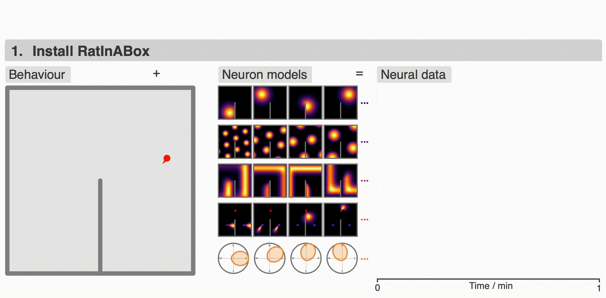

---

##### Download

+ [Paper](ratinabox.pdf)
+ [eLife](https://elifesciences.org/articles/85274)
+ [Github](https://github.com/RatInABox-Lab/RatInABox)


---

##### Abstract

Generating synthetic locomotory and neural data is a useful yet cumbersome step commonly required to study theoretical models of the brain’s role in spatial navigation. This process can be time consuming and, without a common framework, makes it difficult to reproduce or compare studies which each generate test data in different ways. In response, we present RatInABox, an open-­source Python toolkit designed to model realistic rodent locomotion and generate synthetic neural data from spatially modulated cell types. This software provides users with (i) the ability to construct one- or two-­dimensional environments with configurable barriers and visual cues, (ii) a physically realistic random motion model fitted to experimental data, (iii) rapid online calculation of neural data for many of the known self-­location or velocity selective cell types in the hippocampal formation (including place cells, grid cells, boundary vector cells, head direction cells) and (iv) a framework for constructing custom cell types, multi-layer network models and data- or policy-­controlled motion trajectories. The motion and neural models are spatially and temporally continuous as well as topographically sensitive to boundary conditions and walls. We demonstrate that out-­of-­the-box parameter settings replicate many aspects of rodent foraging behaviour such as velocity statistics and the tendency of rodents to over-­explore walls. Numerous tutorial scripts are provided, including examples where RatInABox is used for decoding position from neural data or to solve a navigational reinforcement learning task. We hope this tool will significantly streamline computational research into the brain’s role in navigation.

---
##### Demo 


(see Github for more)

---

##### Citation

George, T. M., Rastogi, M., de Cothi, W., Clopath, C., Stachenfeld, K., & Barry, C. (2024). RatInABox, a toolkit for modelling locomotion and neuronal activity in continuous environments. Elife, 13, e85274.

```BibTeX
@article{george2024ratinabox,
  title={RatInABox, a toolkit for modelling locomotion and neuronal activity in continuous environments},
  author={George, Tom M and Rastogi, Mehul and de Cothi, William and Clopath, Claudia and Stachenfeld, Kimberly and Barry, Caswell},
  journal={Elife},
  volume={13},
  pages={e85274},
  year={2024},
  publisher={eLife Sciences Publications Limited}
}
```

---

##### Related material

+ [Nature methods spotlight](https://www.nature.com/articles/s41592-024-02251-4)
+ [eLife digest](https://elifesciences.org/digests/85274/modelling-motion-with-ratinabox)
+ [Sainsbury Wellcome Centre article](https://www.sainsburywellcome.org/web/blog/ratinabox-new-toolkit-modelling-navigation-brain)
+ [Reviewer responses](responses.pdf)
+ [Cosyne abstract (2-page summary)](cosyne_riab.pdf)
+ [Cosyne poster](cosyneposter_riab.pdf)