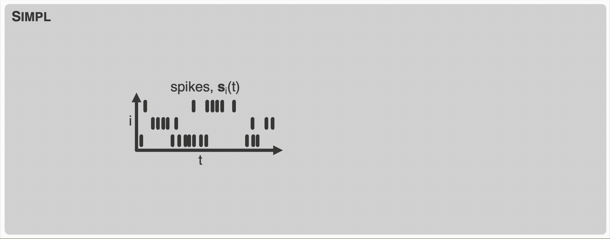

---

##### Download

+ [OpenReview (ICLR)](https://openreview.net/forum?id=9kFaNwX6rv)
+ [Paper](simpl.pdf)
+ [Code and data](https://github.com/TomGeorge1234/SIMPL)

---

##### Abstract

Neural activity in the brain is known to encode low-dimensional, time-evolving, behaviour-related variables. A long-standing goal of neural data analysis has been to identify these variables and their mapping to neural activity. A productive and canonical approach has been to simply visualise neural "tuning curves" as a function of behaviour. However, significant discrepancies between behaviour and the true latent variables -- such as an agent thinking of position Y whilst located at position X -- distort and blur the tuning curves, decreasing their interpretability. To address this, latent variable models propose to learn the latent variable from data; these are typically expensive, hard to tune, or scale poorly, complicating their adoption. Here we propose SIMPL (Scalable Iterative Maximization of Population-coded Latents), an EM-style algorithm which iteratively optimises latent variables and tuning curves. SIMPL is fast, scalable and exploits behaviour as an initial condition to further improve convergence and identifiability. It can accurately recover latent variables in spatial and non-spatial tasks. When applied to a large hippocampal dataset SIMPL converges on smaller, more numerous, and more uniformly sized place fields than those based on behaviour, suggesting the brain may encode space with greater resolution than previously thought.

---

##### Citation

George, T. M., Glaser, P., Stachenfeld, K., Barry, C., & Clopath, C. (2025). SIMPL: Scalable and hassle-free optimisation of neural representations from behaviour. In The Thirteenth International Conference on Learning Representations.

```BibTeX
@inproceedings{
george2025simpl,
title={SIMPL: Scalable and hassle-free optimisation of neural representations from behaviour},
author={Tom George and Pierre Glaser and Kim Stachenfeld and Caswell Barry and Claudia Clopath},
booktitle={The Thirteenth International Conference on Learning Representations},
year={2025},
url={https://openreview.net/forum?id=9kFaNwX6rv}
}
```

---

##### Related material

+ [Two page summary](cosyne.pdf)
+ [Poster](simpl_poster.pdf)
