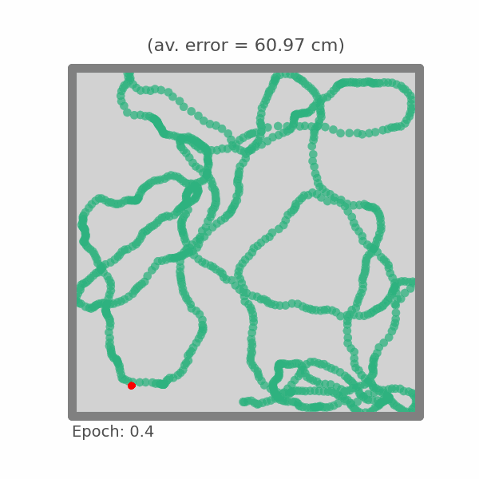
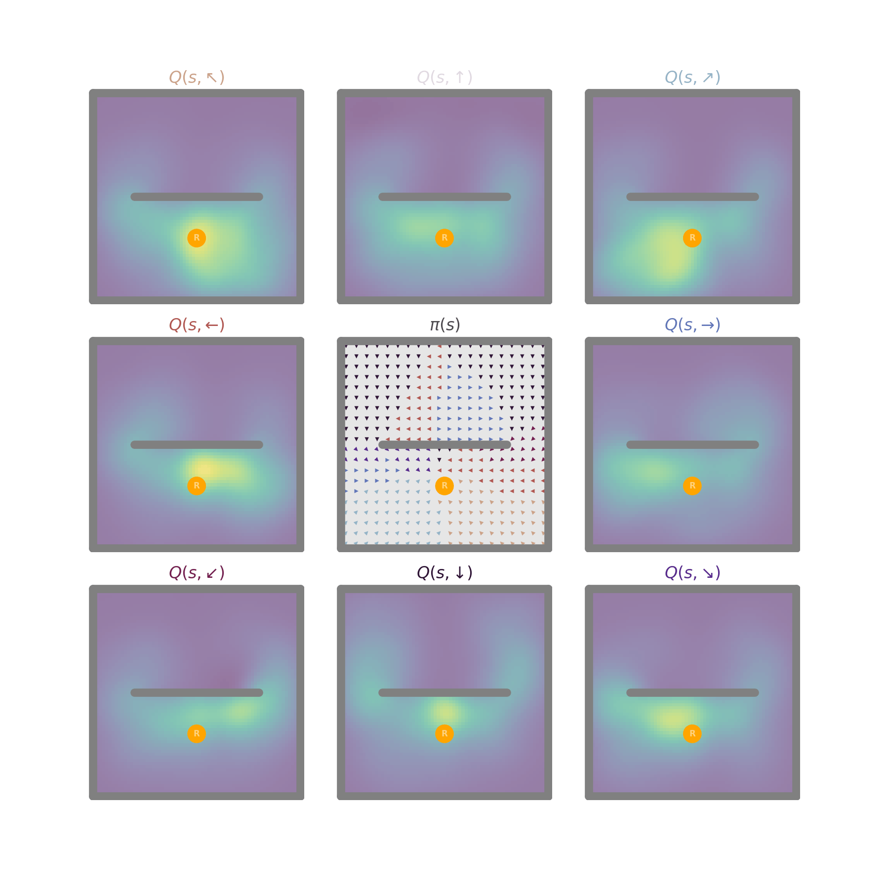

## Teaching materials 

A list of teaching materials by Tom George. These are all open-source and free to use/adapt by anyone.

--- 

### [Hopfield Networks](https://github.com/TomGeorge1234/HopfieldNetworkTutorial)

Hopfield Networks: This tutorial goes from simple binary patterns to learning all the flags of Africa in a modern Hopfield network. Made for the TReND CaMinA summer school.

---

### [Deep Learning from Scratch](https://github.com/TomGeorge1234/DeepLearningTutorial)

Deep learning from scratch: We build and train deep networks to solve a neuro-inspired regression task. Importantly there’s no autograd package here. Understand the equations of backprop and write them in python code…also for TReND CaMinA

---

### [NeuroRL](https://github.com/TomGeorge1234/NeuroRLTutorial)

Made with Jesse Geerts; we start from Rescorla Wagner and step through to closed loop policy optimisation (SARSA) with place cell state features. Made for the UvA_Amsterdam NeuroAI summer school (2023). 

---

### [Spatial representations](https://github.com/TomGeorge1234/ModellingSpatialRepresentations)

An all-in-one tutorial for modelling spatial environments, 2D motion and biological cells types in RatInABox. Also for  TReND CaMinA

---

### Others 

These other tutorials are a less refined than the above four (they don't contain exercises and may require some background knowledge) on more advanced topics. They're were built as demos for the RatInABox package but perhaps they'll be of use...

+ [**RL with continuous time, space and actions**](https://github.com/RatInABox-Lab/RatInABox/blob/main/demos/reinforcement_learning_example.ipynb)
+ [**Actor-critic**](https://github.com/RatInABox-Lab/RatInABox/blob/main/demos/actor_critic_example.ipynb) (like the above but with deep policy approximation, also using @SynapticSage's RiaB gymnasium wrapper)
+ [**Successor features**](https://github.com/RatInABox-Lab/RatInABox/blob/main/demos/successor_features_example.ipynb): like successor representations but made from place cells
+ [**Path integration**](https://github.com/RatInABox-Lab/RatInABox/blob/main/demos/path_integration_example.ipynb)
+ [**Deep learning bespoke spatial representations**](https://github.com/RatInABox-Lab/RatInABox/blob/main/demos/deep_learning_example.ipynb)
+ [**Splitter cells**](https://github.com/RatInABox-Lab/RatInABox/blob/main/demos/splitter_cells_example.ipynb)
+ [**Conjunctive representations**](https://github.com/RatInABox-Lab/RatInABox/blob/main/demos/conjunctive_gridcells_example.ipynb) in the hippocampus
+ [**Position decoding**](https://github.com/RatInABox-Lab/RatInABox/blob/main/demos/decoding_position_example.ipynb): Place vs. Grid. vs Boundary cells
